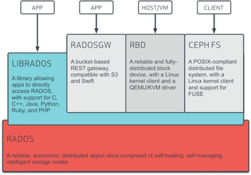

> ceph官方文档 http://docs.ceph.org.cn/

> ceph中文开源社区 http://ceph.org.cn/

# Ceph基础介绍
Ceph是一个可靠地、自动重均衡、自动恢复的分布式存储系统，根据场景划分可以将Ceph分为三大块，分别是对象存储、块设备存储和文件系统服务。
Ceph相比其它存储的优势点在于它不单单是存储，同时还充分利用了存储节点上的计算能力，在存储每一个数据时，都会通过计算得出该数据存储的位置，尽量将数据分布均衡，同时由于Ceph的良好设计，采用了CRUSH算法、HASH环等方法，使得它不存在传统的单点故障的问题，且随着规模的扩大性能并不会受到影响。

# Ceph核心组件
- OSD: 全称是Object Storage Device，它的主要功能是存储数据、复制数据、平衡数据、恢复数据等，与其它OSD间进行心跳检查等，并将一些变化情况上报给Ceph Monitor。一般情况下一块硬盘对应一个OSD，由OSD来对硬盘存储进行管理，当然一个分区也可以成为一个OSD。
- Monitor: 负责监视Ceph集群，维护Ceph集群的健康状态，同时维护着Ceph集群中的各种Map图，比如OSD Map、Monitor Map、PG Map和CRUSH Map，这些Map统称为Cluster Map，Cluster Map是RADOS的关键数据结构，管理集群中的所有成员、关系、属性等信息以及数据的分发，比如当用户需要存储数据到Ceph集群时，OSD需要先通过Monitor获取最新的Map图，然后根据Map图和object id等计算出数据最终存储的位置。
- MDS: 全称是Ceph MetaData Server，主要保存的文件系统服务的元数据（只有文件系统服务才需要）
- Manager: 负责跟踪运行时间指标和Ceph群集的当前状态，包括存储利用率，当前性能指标和系统负载。 Ceph Manager守护程序还托管基于python的插件来管理和公开Ceph集群信息，包括基于Web的仪表板和REST API。 通常，至少有两名Manager需要高可用性。
# Ceph基础架构

最底层的是RADOS，RADOS自身是一个完整的分布式对象存储系统，它具有可靠、智能、分布式等特性，Ceph的高可靠、高可拓展、高性能、高自动化都是由这一层来提供的，用户数据的存储最终也都是通过这一层来进行存储的，RADOS可以说就是Ceph的核心。

RADOS系统主要由两部分组成，分别是OSD和Monitor。

基于RADOS层的上一层是LIBRADOS，LIBRADOS是一个库，它允许应用程序通过访问该库来与RADOS系统进行交互，支持多种编程语言，比如C、C++、Python等。

基于LIBRADOS层开发的又可以看到有三层，分别是RADOSGW、RBD和CEPH FS。

RADOSGW：RADOSGW是一套基于当前流行的RESTFUL协议的网关，并且兼容S3和Swift。

RBD：RBD通过Linux内核客户端和QEMU/KVM驱动来提供一个分布式的块设备。

CEPH FS：CEPH FS通过Linux内核客户端和FUSE来提供一个兼容POSIX的文件系统。
# Ceph维护
### 健康监控
```
ceph -s
ceph health
```
### 空间使用
```
ceph df
ceph osd df
```
### 删除OSD
1. 停止osd进程，让其他的osd知道这个节点不提供服务了
2. 将节点状态标记为out
```
ceph osd out {id} 
```
执行之后会触发数据的恢复，等待恢复完成集群状态为HEALTH_OK后再进行下一步操作

3. 从crush中移除节点
```
ceph osd crush remove {name} 
```
执行之后会触发数据的迁移

4. 删除节点
```
ceph osd rm {name} 
```
5. 删除节点认证（不删除编号会占住）
```
ceph auth del {name} 
```
> 注：整个过程会触发两次迁移，建议在停止osd进程之前ceph osd crush reweight {name} 0，这个过程实际上是让数据不分布在这个节点上，让数据慢慢的分布到其他节点上，直到最终为没有分布在这个osd，并且迁移完成。在osd 的crush 为0 后， 再对这个osd的任何删除相关操作都不会影响到集群的数据的分布

# Ceph命令解释
```
# ceph -h
一般用法：
ceph [-h] [-c CEPHCONF] [-i INPUT_FILE] [-o OUTPUT_FILE]
            [--id CLIENT_ID] [--name CLIENT_NAME] [--cluster CLUSTER]
            [--admin-daemon ADMIN_SOCKET] [--admin-socket ADMIN_SOCKET_NOPE]
            [-s] [-w] [--watch-debug] [--watch-info] [--watch-sec]
            [--watch-warn] [--watch-error] [--version] [--verbose] [--concise]
            [-f {json,json-pretty,xml,xml-pretty,plain}]
            [--connect-timeout CLUSTER_TIMEOUT]
Ceph管理工具：
可选参数：
 -h, --help      #请求帮助
 -c CEPHCONF, --conf CEPHCONF      #ceph配置文件
 -i INPUT_FILE, --in-file INPUT_FILE #输入文件
 -o OUTPUT_FILE, --out-file OUTPUT_FILE  #输出文件
 --id CLIENT_ID, --user CLIENT_ID  #用户身份验证
 --name CLIENT_NAME, -n CLIENT_NAME  #客户端名称进行认证
--cluster CLUSTER   #集群名称
--admin-daemon ADMIN_SOCKET  #提交admin-socket命令
--admin-socket ADMIN_SOCKET_NOPE  #意味着--admin-daemon
-s, --status   #显示集群状态
-w, --watch    #观看实时集群更改
--watch-debug   #监视调试事件
--watch-info    #监视信息事件
--watch-sec     #监视安全事件
--watch-warn    #监视警告事件
--watch-error   #监视错误事件
--version, -v   #展示版本
--verbose       #展示详细信息
--concise       #精简输出
-f {json,json-pretty,xml,xml-pretty,plain}, --format {json,json-pretty,xml,xml-pretty,plain}
--connect-timeout CLUSTER_TIMEOUT  #设置连接到集群的超时时间
监视命令（[联系监视器，5秒后超时]）：
osd blacklist add|rm <EntityAddr> {<float[0.0-]>} #添加到黑名单里面多少秒到期或者把地址从黑名单里面删掉
osd blacklist clear        #清除所有列入黑名单的客户
osd blacklist ls           #显示黑名单的客户
osd blocked-by             #打印OSD的阻止对等体的直方图
osd create {<uuid>} {<int[0-]>}   #创建新的osd（带有可选的UUID和ID）
osd crush add <osdname (id|osd.id)>  <float[0.0-]> <args> [<args>...]  #添加或更新crush map位置
osd crush add-bucket <name> <type>    #添加类型为<type>的无父（可能是根）crush <name>
osd crush create-or-move <osdname (id|osd.id)> <float[0.0-]> <args> [<args>...]  #在/位置<args>创建条目或移动<name> <weight>的现有条目
osd crush dump    #导出打印crush
osd crush get-tunable straw_calc_version  #得到可调的调整<tunable>
osd crush link <name> <args> [<args>...]   #<br><div id="inner-editor"></div>68/5000将<name>的现有条目链接到位置<args>下
osd crush move <name> <args> [<args>...]   #将<name>的现有条目移动到位置<args>
osd crush remove <name> {<ancestor>}       #从crush map（无处不在，或只在<ancestor>）删除<name>
osd crush rename-bucket <srcname>  <dstname>   #将bucket <srcname>重命名为<dstname>
osd crush reweight <name> <float[0.0-]>    #在crush map中将<name>的重量更改为<weight>
osd crush reweight-all                     #重新计算树的权重，以确保其正确合计
osd crush reweight-subtree <name> <float[0.0-]>  
osd crush rm <name> {<ancestor>}   #从crush map（无处不在，或只在<ancestor>）删除<name>
osd crush rule create-erasure <name> {<profile>}  #创建使用<profile>创建的擦除编码池的默认规则<name>（默认默认值）
osd crush rule create-simple <name>  <root> <type> {firstn|indep} #创建压缩规则<name>从<root>开始，使用<firstn | indep>的选择模式（默认为firstn; indep最适合擦除池）复制到类型为<type>的数据桶;
osd crush rule dump {<name>}   #dump crush rule <name>（默认为全部）
osd crush rule list            #列出crush规则
osd crush rule ls              #列出crush规则
osd crush rule rm <name>       #删除crush规则<name>
osd crush set                  #从输入文件设置crush地图
osd crush set <osdname (id|osd.id)> <float[0.0-]> <args> [<args>...]  
osd crush set-tunable straw_calc_version <int>      #将可调参数<tunable>设置为<value>
osd crush show-tunables        #显示当前的粉碎可调参数
osd crush tree                 #在树视图中转储crush和项目
osd crush tunables legacy|argonaut|bobtail|firefly|hammer|jewel|optimal|default   #将压缩可调参数值设置为<profile>
osd crush unlink <name> {<ancestor>}          #取消链接<name>与crush map
osd deep-scrub <who>               #在osd <who>上启动深度擦洗
osd df {plain|tree}                #显示OSD利用率
osd down <ids> [<ids>...]           #设置osd（s）<id> [<id> ...]下线
osd dump {<int[0-]>}                #OSD打印摘要
osd erasure-code-profile get <name>   #获取擦除代码配置文件<name>
osd erasure-code-profile ls           #列出所有擦除代码配置文件
osd erasure-code-profile rm <name>    #删除擦除代码配置文件<name>
osd erasure-code-profile set <name>  {<profile> [<profile>...]}   #使用[<key [= value]> ...]对创建擦除代码配置文件<name>。 最后添加一个--force来覆盖现有的配置文件（非常危险）
osd find <int[0-]>                    #在CRUSH map中找到osd <id>并显示其位置
osd getcrushmap {<int[0-]>}           #获取crush map
osd getmap {<int[0-]>}                #获取OSD map
osd getmaxosd                         #显示最大的OSD ID
osd in <ids> [<ids>...]               #设置osd（s）<id> [<id> ...]进入
osd lost <int[0-]> {--yes-i-really-mean-it}  #将osd标记为永久丢失。 如果没有更多的REPLICAS存在，请保留此数据
osd ls {<int[0-]>}                    #显示所有OSD ids
osd lspools {<int>}                   #列表池
osd map <poolname> <objectname>  {<nspace>}  #在[pool]中使用[namespace]查找<object>的pg
osd metadata {<int[0-]>}                 #提取osd {id}的元数据（默认为全部）
osd out <ids> [<ids>...]                   #设置osd（s）<id> [<id> ...]退出
osd pause                              #暂停osd
osd perf                               #打印OSD dump总结统计
osd pg-temp <pgid> {<id> [<id>...]}    #设置pg_temp映射pgid：[<id> [<id> ...]]（仅限开发人员）
osd pool create <poolname> <int[0-]> {<int[0-]>} {replicated|erasure} {<erasure_code_profile>} {<ruleset>} {<int>}  #创建存储池
osd pool delete <poolname> {<poolname>} {--yes-i-really-really-mean-it}  #删除存储池
osd pool get <poolname> size|min_size|crash_replay_interval|pg_num|pgp_num| crush_ruleset|hashpspool|nodelete|nopgchange|nosizechange|write_fadvise_dontneed|noscrub|nodeep-scrub|hit_set_type|hit_set_period|hit_set_count|hit_  
 set_fpp|auid|target_max_objects|target_max_bytes|cache_target_dirty_ratio|cache_target_dirty_high_ratio|cache_target_full_ratio|cache_min_flush_age|cache_min_evict_age|erasure_code_profile|min_read_recency_for_promote|   
 all|min_write_recency_for_promote|fast_read|hit_set_grade_decay_rate|hit_set_search_last_n|scrub_min_interval|scrub_max_interval|deep_scrub_interval|recovery_priority|recovery_op_priority|scrub_priority 
#获取存储池的参数值
osd pool get-quota <poolname>    #获取池的对象或字节限制
osd pool ls {detail}        #池列表
osd pool mksnap <poolname> <snap>   #在<pool>中创建快照<snap>
osd pool rename <poolname> <poolname>   #将<srcpool>重命名为<destpool>
osd pool rm <poolname> {<poolname>} {--yes-i-really-really-mean-it}   #删除存储池
osd pool rmsnap <poolname> <snap>    #从<pool>中删除快照<snap>
osd pool set <poolname> size|min_size|剩下的跟上面那一大波var一致        #将池参数<var>设置为<val>
osd pool set-quota <poolname> max_objects|max_bytes <val>     #在池上设置对象或字节限制
osd pool stats {<name>}      #从所有池或从指定池获取统计信息
osd primary-affinity <osdname (id|osd.id)> <float[0.0-1.0]>    #从0.0 <= <weight> <= 1.0调整osd初级亲和力
osd primary-temp <pgid> <id>     #设置primary_temp映射pgid：<id> | -1（仅限开发人员）
osd repair <who>             #在osd <who>上启动修复
osd reweight <int[0-]> <float[0.0-1.0]>   
osd reweight-by-pg {<int>} {<float>} {<int>} {<poolname> [<poolname>...]}  #通过PG分配重载OSD
osd reweight-by-utilization {<int>} {<float>} {<int>} {--no-increasing}    
osd rm <ids> [<ids>...]     #删除osd（s）<id> [<id> ...]
osd scrub <who>             #在osd <who>上启动擦除
osd set full|pause|noup|nodown|noout|noin|nobackfill|norebalance|norecover|noscrub|nodeep-scrub|notieragent|sortbitwise|require_jewel_osds   #设置<key>
osd setcrushmap            #从输入文件设置crush map
osd setmaxosd <int[0-]>    #设置新的最大osd值
osd stat                   #OSD map打印摘要
osd test-reweight-by-pg {<int>}{<float>} {<int>} {<poolname>  [<poolname>...]}  #通过PG分配的OSD的运行
osd test-reweight-by-utilization {<int>} {<float>} {<int>} {--no-increasing}
osd thrash <int[0-]>     
osd tier add <poolname> <poolname> {--force-nonempty}  #将层<tierpool>（第二个）添加到基池“池”（第一个）
osd tier add-cache <poolname> <poolname> <int[0-]>    #将大小<size>的缓存<tierpool>（第二个）添加到现有池<pool>（第一个）
osd tier cache-mode <poolname> none|writeback|forward|readonly|readforward|proxy|readproxy {--yes-i-really-mean-it}   #指定缓存的缓存模式
osd tier remove <poolname> <poolname>   #从基本池<pool>（第一个）删除层<tierpool>（第二个）
osd tier remove-overlay <poolname>      #删除基本池<pool>的覆盖池
osd tier rm <poolname> <poolname>       #从基本池<pool>（第一个）删除层<tierpool>（第二个）
osd tier rm-overlay <poolname>          #删除基本池<pool>的覆盖池
osd tier set-overlay <poolname> <poolname>  #将基池<pool>的覆盖池设置为<overlaypool>
osd tree {<int[0-]>}                    #打印OSD树
osd unpause                             #取消暂停
osd unset full|pause|noup|nodown|noout|noin|nobackfill|norebalance|norecover|noscrub|nodeep-scrub|notieragent|sortbitwise   #unset <key>
osd utilization                         #获取基本的pg分布统计信息
```
